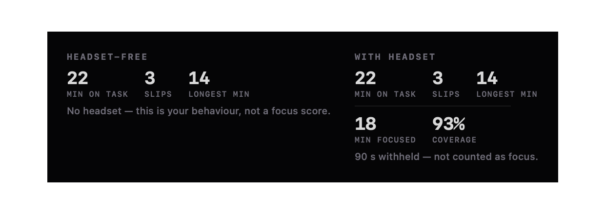
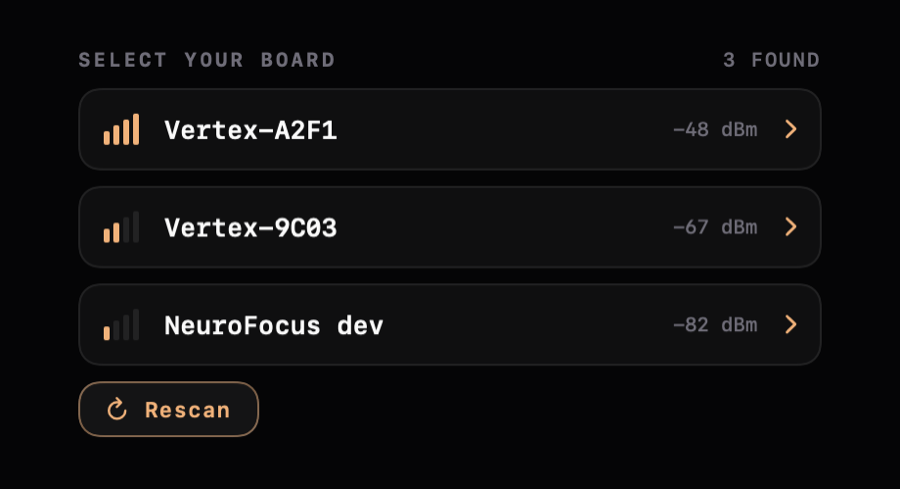

<div align="center">


# NeuroSync

**A macOS instrument for a single-channel dry-EEG headset.**

It streams raw ADC counts from the board over Bluetooth, computes the Pope engagement index
on-device — and refuses to show you a number the moment it can't defend one.

[](https://github.com/enkhbold470/neurosync/releases/latest/download/neurosync.dmg)
[](#build)
[](#architecture)
[](#tests)
[](LICENSE)


</div>

---

## There is no demo mode

That screenshot is not an error state. It is the entire thesis.

Most focus trackers will happily show you a score with the sensor sitting on a desk. They can,
because a detached electrode collapses α and θ toward the ADC noise floor — which makes β/(α+θ)
*explode*. Ungated, an unplugged headset reads as flawless concentration.

**No fabricated number reaches a surface in this app.** With no board on a head you get `No signal`,
an empty chart that says *"no trusted signal recorded yet today"*, and dashes where the numbers
would be. Every figure here is measured, or computed by the DSP from a real signal, or it is not
shown.

There *is* a signal generator in the repo — `Synthetic/`, used to design the UI without hardware —
and it is walled off at the data level, not just visually. It fabricates **voltages** (raw ADC
counts, which then go through the same DSP, the same gates and the same state machine as a board's),
never a **score**. It has no channel through which to say "focus was 72", and it must never acquire
one. Every generated record carries `synthetic: true` plus a provenance note that `Store.write`
refuses to write without, the flag is decoded from the file rather than inferred from a filename,
and synthetic data can never reach the menu bar, the live gauge, or any aggregate mixed with real
sessions.

## Install

```bash
# notarized, stapled, Developer ID signed — opens with no Gatekeeper warning
open https://github.com/enkhbold470/neurosync/releases/latest/download/neurosync.dmg
```

The app checks for updates through [Sparkle](https://sparkle-project.org) against a signed appcast
(EdDSA), and there's a **Check for Updates…** menu item. Or [build it yourself](#build) — no package
manager, and the only dependency is Sparkle.

## A session, on one page


One window. The live score, your focus by hour, what the day found, yesterday, and which apps
actually held your attention. Every one of those is computed from **trusted epochs only** — a second
behind a closed gate is not a zero and not the last good value, it is absent, and absence is drawn
as absence.

The score is `—` whenever a gate is closed or nothing is connected, and the reason is printed
directly under it. A finding always carries its confound: *"51% of Claude coding read as
mind-wandering"* is followed by the sentence explaining that it is a candidate, not proof of what
you were thinking about.

## The headset is optional



A **Focus Block** (15 / 25 / 50 min) runs in two tiers that stack:

- **Headset-free, always.** A timer, a drift detector fed by your frontmost app, and a behavioural
  recap. The signal is the app's **bundle id and nothing else** — no window titles, no document
  names, no URLs, no keystrokes, no screen contents.
- **Headset-augmented**, when a board is connected: the same, plus the EEG layer — minutes of
  measured focus, longest focused stretch, coverage.

`BlockRecap.brain` is an `Optional`, which is what makes the left-hand recap above impossible to
mistake for a brain measurement: with no headset there are no brain epochs, so there is no focus
score to render, and the recap says so in words.

If the live score stays deep below your baseline, the app says so once — a Dock badge and a banner,
debounced so a long slump is one cue and not a storm. Recovery, never a scolding.

## The three refusals

The gates are not error handling. They are the product. `Core/Focus.swift` will refuse to emit a
score, and the app prints the refusal in the score's place:

| Gate | Refuses when | In the app's words |
|---|---|---|
| `signalOk` | broadband RMS ≤ 1.5 µV | *"0.31 µV RMS — below the 1.5 µV noise floor. The electrode is not making skin contact."* |
| `fsOk` | sample rate < 175 SPS | *"60 Hz mains folds to 30.0 Hz at 90 SPS and cannot be notched — directly inside β, the focus numerator."* |
| `calibrating` | baseline not yet frozen | *"12 s of good signal remaining. 50 will mean YOUR baseline."* |

Below 175 SPS the index is indefensible: β reaches 30 Hz, and **60 Hz mains aliases straight into
the β band** at 45 SPS (→15 Hz) and 90 SPS (→30 Hz), where it cannot be notched. Hum would read as
concentration.

When the contact gate closes, the score **freezes** at its last good value. It does not decay, and
it never spikes. That property is pinned by a test, because if it ever broke silently the app would
be lying in the most convincing way possible.

## The metric

The score is the engagement index of **Pope, Bogart & Bartolome (1995)** ([PMID 7647180][pope]):

```
E = β / (α + θ)
```

It is **never** θ/β — that ratio rises with *in*attention. E is unbounded, so it's mapped to 0–100
by a logistic in log-ratio against a per-user baseline E₀, taken as the **median** of 160 gated
updates over 20 s and then **frozen**:

```
score = 100 / (1 + (E₀/E)^k)        k = 1.5
```

which is exactly **50 when E = E₀**, and 60 is the flow line.

**50 means your own baseline.** The number is not comparable between people, and only within one
session. β also overlaps jaw and neck EMG, so clenching your teeth raises "focus" exactly as
concentrating does — which is why `clench` (jaw EMG against your own resting baseline) is tracked
separately and a clenched second is **excluded from time in flow** even when the focus number is
high. `calm` (the α share) is the third number, and it is explicitly *not* `100 − focus`.

What one around-ear channel **cannot** measure: stress, anxiety, or mind-wandering-from-the-signal.
Alpha-up disengagement looks identical whether you drifted off at the compiler or rested on a walk —
what separates `daydream` from `calm` is whether you *meant* to be concentrating, and that comes
from your calendar, your frontmost app, or a key you pressed. It is never inferred from the EEG,
because that would make every finding circular. Stress and anxiety are **self-reported markers**:
you press a key, and the app records that you pressed it.

[pope]: https://pubmed.ncbi.nlm.nih.gov/7647180/

## Menu bar


The focus number lives next to the clock, so you don't have to watch a dashboard to use it.

The menu bar is the **most dangerous surface in the app**. A number in the window sits beside a
gate, a calibration state and a paragraph of caveats. A number beside the clock has nowhere to put
the reason — it is glanced at and believed. So it shows a dash unless *every* gate is open,
including the frozen score behind a closed contact gate, which the window may show greyed but the
menu bar must not surface at all.

A stale `88` next to the clock is indistinguishable from a live `88`.

It reads the **live model and only the live model** — persisted data, synthetic or real, has no path
to it, and a test pins that.

<br clear="right">

## Your board, not whichever one shouted first



Scanning lists what it found with RSSI and lets you pick. The ESP32 accepts **one BLE central at a
time** and the firmware has no stale-connection handling, so NeuroSync holds exactly one link and
always disconnects cleanly — an unclean drop leaves the board pumping notifies into a dead link and
*not advertising* until the supervision timeout expires.

## Hardware

Built for the **NeuroFocus Vertex v4** — a single around-ear dry electrode in a gaming headset
insert. Not Fp1, not frontal, not prefrontal: an earpad electrode is physically *around-ear*.

| | |
|---|---|
| MCU | Seeed XIAO ESP32-S3 |
| ADC | TI ADS1220, 24-bit ΔΣ, AIN0 single-ended |
| Front end | AD8422 instrumentation amp, G = 100 |
| Channels | **1** (proof of concept, scaling toward 8) |
| Sample rate | runtime-selectable: 20/45/90/**175**/330/600/1000/2000 SPS |
| Transport | BLE, `[0xE7 0x1E][seq u16 LE][n u8][n × i32 LE]` |

The firmware is the source of truth for the wire protocol; `BLE/VertexProtocol.swift` is derived
from it, never from memory. Two things there are silent footguns and are documented in the source:

- **The command characteristic also notifies.** `INFO`/`DIAG` come back on it, and the peripheral
  drops a notify whose CCCD isn't enabled — so you must subscribe *before* writing `i`.
- **The sample rate survives a BLE reconnect.** A client that assumes the 175 SPS boot default
  after reconnecting to a board someone left at 600 renders real 10 Hz α at ~34 Hz, and every
  frequency in the spectrum slides by the same ratio. Always read `sps` from `INFO`.

Also: **µV are not µV.** The wire carries raw ADC counts and we scale them ourselves (AD8422 ×100 →
3.93 nV/count at the electrode). The firmware's own `AFE_GAIN` is a placeholder of `1.0`, so the
board's `DIAG` µV strings are ADC-referred and read ~100× larger. Never mix the two.

## Where your data lives

Plain JSON on your Desktop, where you can open it, read it, diff it, and delete it. No database, no
iCloud, no server required.

```
~/Desktop/neurosync-local/
  index.json                        schema version + a manifest of what exists
  sessions/<iso8601>--<uuid>.json   one file per session
  days/<yyyy-mm-dd>.json            derived rollups — regenerable, safe to delete
  markers.jsonl                     append-only self-report log
```

A withheld score is written as **`null`**, never `0` — and stays `null` through every round trip.

| Surface | What it may touch |
|---|---|
| Calendar (EventKit) | **Read-only.** Never creates, edits or deletes an event. macOS Calendar already syncs Google Calendar, so there's no OAuth and no token to leak. |
| App context | The frontmost app's **bundle id**, sampled every 5 s. Nothing else. |
| Cloud sync | **Opt-in and off by default.** Local files stay the source of truth; the cloud (Convex + Clerk) is a one-way idempotent mirror. Synthetic sessions are never uploaded. See [CLOUD_SETUP.md](CLOUD_SETUP.md). |
| Crash reporting | Errors only, anonymous, and **off entirely without a key**. Never brain data, session content, activity, calendar data or PII — the boundary is written into `Telemetry/Telemetry.swift`. |

App Sandbox is on, and every entitlement is justified in `neurosync.entitlements`: Bluetooth,
Calendar (read), the one Desktop folder, user-selected files, and outgoing network for opt-in sync.

## Architecture

```
BLE/VertexProtocol.swift   wire contract — UUIDs, frame decode, INFO/DIAG parse, rate ladder
BLE/VertexLink.swift       CoreBluetooth central + DSP, on its own serial queue (nonisolated)
Core/DSP.swift             biquads, filter chain, Welch PSD, band powers, counts→µV
Core/Focus.swift           Pope index, the frozen baseline, focus + calm + clench, the three gates
Core/BrainState.swift      focused/daydream/calm/clenched/withheld, dwell hysteresis (nonisolated)
Core/Gate.swift            which refusal is blocking a score; what the menu bar may say
Core/FocusBlock.swift      the hardware-optional block, drift detection, the recap
Core/FocusNudge.swift      sustained-low-focus escalation, with hysteresis
Context/Activity.swift     activity + marker taxonomy, bundle/calendar classifiers, coalescing
Context/ActivityWatcher.swift  live EventKit (read-only) + frontmost-app (bundle id only)
Data/SessionRecord.swift   the on-disk JSON schema; a null score means "withheld", never zero
Data/Recorder.swift        counts→1 Hz epochs (EpochBuilder), shared by live + synthetic paths
Data/Store.swift           ~/Desktop/neurosync-local/, sandbox routes, the synthetic wall
Data/DayRollup.swift       segments, the findings engine, the labelled proxies
Cloud/                     opt-in Convex + Clerk mirror (local stays source of truth)
Synthetic/                 waveform generator + scripted days + the --generate-synthetic CLI
App/VertexModel.swift      @MainActor view state; owns the link + live recording, no DSP of its own
App/DayModel.swift         @MainActor state over persisted days; owns the Store
UI/                        theme, glass, session page, menu bar, canvases
```

Signal flows one way: **CoreBluetooth → decode → FocusEngine → snapshot → @MainActor.** The link
never touches the UI; the model never touches the radio or the DSP.

The DSP is ported constant-for-constant from the browser analyzer so the two cannot disagree about
what a brain is doing. Two deviations from `scipy.signal.welch` are load-bearing and easy to trip
over: the Hann window is **symmetric** (`n-1` denominator, not scipy's periodic) and the detrend is
**linear** (not scipy's constant). Matching scipy would silently shift every band power.

Everything is `@MainActor` by default (`SWIFT_DEFAULT_ACTOR_ISOLATION = MainActor`); the DSP and the
BLE link are explicitly `nonisolated` because they run on a background serial queue.

## Build

Requires Xcode 26+ and macOS 26.1+. No package manager; Sparkle resolves through SPM.

```bash
git clone https://github.com/enkhbold470/neurosync.git
cd neurosync
xcodebuild build -scheme neurosync -destination 'platform=macOS,arch=arm64'
```

Or just open `neurosync.xcodeproj` and hit run. Files added anywhere under `neurosync/`,
`neurosyncTests/` or `neurosyncUITests/` join their target automatically — all three are
`PBXFileSystemSynchronizedRootGroup`s, so **never** hand-edit `project.pbxproj` to add a file.

CoreBluetooth needs `com.apple.security.device.bluetooth` plus `NSBluetoothAlwaysUsageDescription` —
both are wired up. The radio is created lazily on your first **Connect**, not at launch, so the
permission prompt appears when you actually ask for it.

A full signed release (`archive → export → notarize → staple → DMG`) is one command,
`./scripts/release.sh`, and the same pipeline runs in CI on a `v*` tag. See [SHIPPING.md](SHIPPING.md).

## Tests

```bash
xcodebuild test -scheme neurosync -destination 'platform=macOS,arch=arm64' -only-testing:neurosyncTests
```

**97 tests, no hardware required.** They pin the things that would put a false number on screen:

- a detached electrode never reads as high focus, and freezes rather than spiking
- the metric is β/(α+θ) — separated by test from both θ/β and β/(α+β)
- 60 Hz mains folds to exactly 30.0 Hz at 90 SPS, and the engine refuses to score there
- the menu bar shows a dash behind every closed gate, and never reads persisted data
- a withheld second is `null` through the JSON round trip, never `0`
- a synthetic session is refused without a provenance note, and never mixes into a real aggregate
- the binary frame decoder rejects truncated frames (a small ATT MTU truncates *silently*)
- α from a real 10 Hz rhythm is found at 10 Hz — not at 34 Hz, which is what hard-coding `fs` does

> **Running a single Swift Testing test?** The trailing `()` is required.
> Without it the filter matches nothing **and `xcodebuild` still exits 0** — a green run that ran
> no tests.
> ```bash
> xcodebuild test -scheme neurosync -destination 'platform=macOS,arch=arm64' \
>   '-only-testing:neurosyncTests/detachedElectrodeNeverReadsAsHighFocus()'
> ```

Every image in this README is rendered by `neurosyncTests/Snapshots.swift` through `ImageRenderer` —
real SwiftUI views, no board and no screen-recording permission. They land in
`~/Library/Containers/com.inkyg.neurosync/Data/tmp/neurosync-shots/`.

To design against a populated day without hardware:

```bash
/path/to/neurosync.app/Contents/MacOS/neurosync --generate-synthetic
```

An explicit opt-in, never run on launch and never used to fill an empty view.

## Status — read this before you judge the screenshots

**No screenshot in this README is a capture of a real brain.** The no-headset shot is exactly what
the app draws with nothing connected — no fixture is involved, which is the point of it. The session
shot is driven by a synthetic fixture pushed through the real DSP: the score, the chart and the
finding are genuinely computed, but the input is a signal generator, not a person.

When a real capture exists, these images get replaced with it and this section gets deleted.

It would have been easy to ship a screenshot that implied otherwise. That is the exact thing this
codebase exists to refuse, and the rule does not stop applying at the README.

## Not a medical device

NeuroSync does not diagnose, treat, cure or prevent anything. Don't make a medical decision with it.

## License

[MIT](LICENSE) © Enkhbold Ganbold
