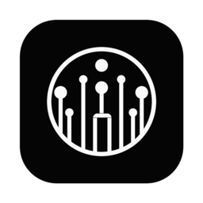
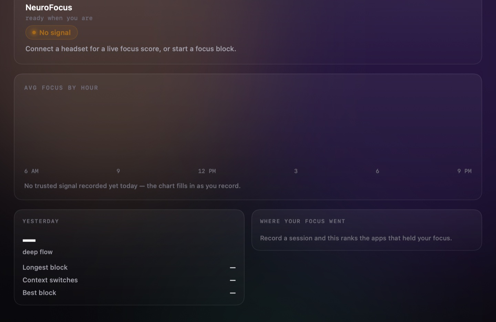
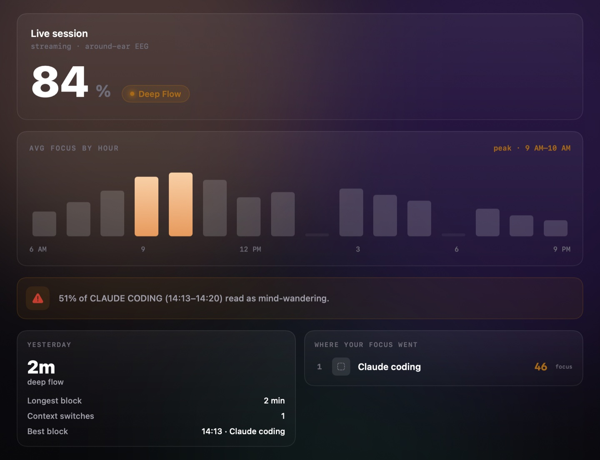

<div align="center">



# NeuroSync

**A macOS instrument for a single-channel dry-EEG headset.**

It streams raw ADC counts from the board over Bluetooth, computes the Pope engagement index
on-device — and refuses to show you a number the moment it can't defend one.

[](https://github.com/enkhbold470/neurosync/releases/latest/download/neurosync.dmg)
[](#build)
[](#architecture)
[](#tests)
[](LICENSE)



</div>

---

## There is no demo mode

That screenshot is not an error state. It is the entire thesis.

Most focus trackers will happily show you a score with the sensor on a desk. They can, because a
detached electrode collapses α and θ toward the ADC noise floor — which makes β/(α+θ) *explode*.
Ungated, an unplugged headset reads as flawless concentration.

**No fabricated number reaches a surface in this app.** With no board on a head you get `No signal`,
an empty chart, and dashes where the numbers would be.

`Synthetic/` exists to design the UI without hardware, and is walled off at the data level rather
than visually: it fabricates **voltages** (raw ADC counts, which then run through the same DSP,
gates and state machine as a board's), never a **score**. Every generated record carries
`synthetic: true` plus a provenance note `Store.write` refuses to write without; the flag is decoded
from the file, never inferred from a filename; and synthetic data can never reach the menu bar, the
live gauge, or any aggregate mixed with real sessions.

## Install

```bash
# notarized, stapled, Developer ID signed — opens with no Gatekeeper warning
open https://github.com/enkhbold470/neurosync/releases/latest/download/neurosync.dmg
```

Updates come through [Sparkle](https://sparkle-project.org) against an EdDSA-signed appcast. Or
[build it yourself](#build) — no package manager, and Sparkle is the only dependency.

## A session, on one page



One window: the live score, focus by hour, what the day found, yesterday, and which apps held your
attention. All of it computed from **trusted epochs only** — a second behind a closed gate is not a
zero and not the last good value, it is absent, and absence is drawn as absence. Every finding
carries its confound: *"51% of Claude coding read as mind-wandering"* is followed by the sentence
saying that's a candidate, not proof of what you were thinking about.

A **Focus Block** (15/25/50 min) runs headset-free — a timer, a drift detector fed by your frontmost
app's **bundle id and nothing else**, and a behavioural recap. With a board connected it adds the EEG
layer. `BlockRecap.brain` is an `Optional`, which is what makes a headset-free recap impossible to
mistake for a brain measurement.

The focus number also lives next to the clock, which is the **most dangerous surface in the app**: a
number in the window sits beside a gate and a paragraph of caveats, while a number beside the clock
is glanced at and believed. So it shows a dash unless *every* gate is open — including the frozen
score behind a closed contact gate, which the window may show greyed but the menu bar must not
surface at all. A stale `88` next to the clock is indistinguishable from a live `88`.

## The three refusals

The gates are not error handling. They are the product. `Core/Focus.swift` will refuse to emit a
score, and the app prints the refusal in the score's place:

| Gate | Refuses when | In the app's words |
|---|---|---|
| `signalOk` | broadband RMS ≤ 1.5 µV | *"0.31 µV RMS — below the 1.5 µV noise floor. The electrode is not making skin contact."* |
| `fsOk` | sample rate < 175 SPS | *"60 Hz mains folds to 30.0 Hz at 90 SPS and cannot be notched — directly inside β, the focus numerator."* |
| `calibrating` | baseline not yet frozen | *"12 s of good signal remaining. 50 will mean YOUR baseline."* |

Below 175 SPS the index is indefensible: β reaches 30 Hz, and **60 Hz mains aliases straight into
the β band** at 45 SPS (→15 Hz) and 90 SPS (→30 Hz), where it cannot be notched. Hum would read as
concentration.

When the contact gate closes the score **freezes** at its last good value. It does not decay, and it
never spikes — pinned by a test, because if that broke silently the app would be lying in the most
convincing way possible.

## The metric

The engagement index of **Pope, Bogart & Bartolome (1995)** ([PMID 7647180][pope]) — `E = β/(α+θ)`.
It is **never** θ/β, which rises with *in*attention. E is unbounded, so it's mapped to 0–100 by a
logistic in log-ratio against a per-user baseline E₀ — the **median** of 160 gated updates over 20 s,
then **frozen**:

```
score = 100 / (1 + (E₀/E)^k)        k = 1.5
```

which is exactly **50 when E = E₀**, and 60 is the flow line.

**50 means your own baseline.** The number is not comparable between people, and only within one
session. β overlaps jaw and neck EMG, so clenching your teeth raises "focus" exactly as concentrating
does — which is why `clench` is tracked separately and a clenched second is **excluded from time in
flow** even when focus reads high. `calm` (the α share) is the third number, and is explicitly *not*
`100 − focus`.

What one around-ear channel **cannot** measure: stress, anxiety, or mind-wandering-from-the-signal.
Alpha-up disengagement looks identical whether you drifted off at the compiler or rested on a walk;
what separates `daydream` from `calm` is whether you *meant* to be concentrating, and that comes from
your calendar, your frontmost app, or a key you pressed — never from the EEG, because that would make
every finding circular. Stress and anxiety are **self-reported markers**: you press a key, and the
app records that you pressed it.

[pope]: https://pubmed.ncbi.nlm.nih.gov/7647180/

## Hardware

Built for the **NeuroFocus Vertex v4** — a single around-ear dry electrode in a gaming headset
insert. Not Fp1, not frontal, not prefrontal: an earpad electrode is physically *around-ear*.

| | |
|---|---|
| MCU | Seeed XIAO ESP32-S3 |
| ADC | TI ADS1220, 24-bit ΔΣ, AIN0 single-ended |
| Front end | AD8422 instrumentation amp, G = 100 |
| Channels | **1** (proof of concept, scaling toward 8) |
| Sample rate | runtime-selectable: 20/45/90/**175**/330/600/1000/2000 SPS |
| Transport | BLE, `[0xE7 0x1E][seq u16 LE][n u8][n × i32 LE]` |

The firmware is the source of truth for the wire protocol; `BLE/VertexProtocol.swift` is derived from
it, never from memory. Three silent footguns, all documented in the source:

- **The command characteristic also notifies.** `INFO`/`DIAG` come back on it, and the peripheral
  drops a notify whose CCCD isn't enabled — subscribe *before* writing `i`.
- **The sample rate survives a BLE reconnect.** Assume the 175 SPS boot default against a board
  someone left at 600 and real 10 Hz α renders at ~34 Hz, every frequency sliding by the same ratio.
  Always read `sps` from `INFO`.
- **µV are not µV.** The wire carries raw ADC counts and we scale them ourselves (AD8422 ×100 →
  3.93 nV/count at the electrode). The firmware's own `AFE_GAIN` is a placeholder of `1.0`, so its
  `DIAG` µV strings are ADC-referred and read ~100× larger.

Scanning lists every board it finds with RSSI and lets you pick. The ESP32 accepts **one BLE central
at a time** and the firmware has no stale-connection handling, so NeuroSync holds exactly one link
and always disconnects cleanly.

## Where your data lives

Plain JSON on your Desktop — open it, read it, diff it, delete it. No database, no iCloud, no server.

```
~/Desktop/neurosync-local/
  index.json                        schema version + a manifest of what exists
  sessions/<iso8601>--<uuid>.json   one file per session
  days/<yyyy-mm-dd>.json            derived rollups — regenerable, safe to delete
  markers.jsonl                     append-only self-report log
```

A withheld score is written as **`null`**, never `0`, and stays `null` through every round trip.

| Surface | What it may touch |
|---|---|
| Calendar (EventKit) | **Read-only.** Never creates, edits or deletes an event. No OAuth, no token to leak. |
| App context | The frontmost app's **bundle id**, sampled every 5 s. No window titles, documents, URLs, keystrokes or screen contents. |
| Cloud sync | **Opt-in, off by default.** Local files stay the source of truth; the cloud (Convex + Clerk) is a one-way idempotent mirror. Synthetic sessions are never uploaded. See [CLOUD_SETUP.md](CLOUD_SETUP.md). |
| Crash reporting | Errors only, anonymous, **off entirely without a key**. Never brain data, session content, activity, calendar data or PII. |

App Sandbox is on, and every entitlement is justified in `neurosync.entitlements`.

## Architecture

```
BLE/          wire contract (UUIDs, frame decode, INFO/DIAG) + the CoreBluetooth central
Core/         DSP (biquads, Welch PSD, band powers) · Focus (Pope, frozen baseline, the gates)
              BrainState · Gate · FocusBlock · FocusNudge
Context/      activity + marker taxonomy; live EventKit (read-only) and frontmost-app sources
Data/         SessionRecord (null = withheld) · Recorder (counts→1 Hz epochs) · Store · DayRollup
Cloud/        opt-in Convex + Clerk mirror (local stays source of truth)
Synthetic/    waveform generator + scripted days + the --generate-synthetic CLI
App/          @MainActor view state: VertexModel (live) and DayModel (persisted)
UI/           theme, glass, session page, menu bar, canvases
```

Signal flows one way: **CoreBluetooth → decode → FocusEngine → snapshot → @MainActor.** The link
never touches the UI; the model never touches the radio or the DSP. Everything is `@MainActor` by
default (`SWIFT_DEFAULT_ACTOR_ISOLATION = MainActor`); the DSP and the BLE link are explicitly
`nonisolated` because they run on a background serial queue.

The DSP is ported constant-for-constant from the browser analyzer so the two cannot disagree about
what a brain is doing. Two deviations from `scipy.signal.welch` are load-bearing: the Hann window is
**symmetric** (`n-1`, not scipy's periodic) and the detrend is **linear** (not constant). Matching
scipy would silently shift every band power.

## Build

Requires Xcode 26+ and macOS 26.1+. No package manager; Sparkle resolves through SPM.

```bash
git clone https://github.com/enkhbold470/neurosync.git
cd neurosync
xcodebuild build -scheme neurosync -destination 'platform=macOS,arch=arm64'
```

All three targets are `PBXFileSystemSynchronizedRootGroup`s — a new file under `neurosync/`,
`neurosyncTests/` or `neurosyncUITests/` joins its target automatically, so **never** hand-edit
`project.pbxproj` to add one. The radio is created lazily on your first **Connect**, not at launch,
so the permission prompt appears when you actually ask for it.

A full signed release (`archive → export → notarize → staple → DMG`) is `./scripts/release.sh`, and
the same pipeline runs in CI on a `v*` tag — see [SHIPPING.md](SHIPPING.md) and
[.github/workflows/README.md](.github/workflows/README.md).

## Tests

```bash
xcodebuild test -scheme neurosync -destination 'platform=macOS,arch=arm64' -only-testing:neurosyncTests
```

**97 tests, no hardware required.** They pin the things that would put a false number on screen:

- a detached electrode never reads as high focus, and freezes rather than spiking
- the metric is β/(α+θ) — separated by test from both θ/β and β/(α+β)
- 60 Hz mains folds to exactly 30.0 Hz at 90 SPS, and the engine refuses to score there
- the menu bar shows a dash behind every closed gate, and never reads persisted data
- a withheld second is `null` through the JSON round trip, never `0`
- a synthetic session is refused without a provenance note, and never mixes into a real aggregate
- the binary frame decoder rejects truncated frames (a small ATT MTU truncates *silently*)
- α from a real 10 Hz rhythm is found at 10 Hz — not at 34 Hz, which is what hard-coding `fs` does

> **Running a single Swift Testing test?** The trailing `()` is required. Without it the filter
> matches nothing **and `xcodebuild` still exits 0** — a green run that ran no tests.
> ```bash
> xcodebuild test -scheme neurosync -destination 'platform=macOS,arch=arm64' \
>   '-only-testing:neurosyncTests/detachedElectrodeNeverReadsAsHighFocus()'
> ```

Every image here is rendered by `neurosyncTests/Snapshots.swift` through `ImageRenderer` — real
SwiftUI views, no board and no screen-recording permission. To design against a populated day
without hardware, `neurosync --generate-synthetic` is an explicit opt-in, never run on launch.

## Status — read this before you judge the screenshots

**No screenshot in this README is a capture of a real brain.** The no-headset shot is exactly what
the app draws with nothing connected — no fixture is involved, which is the point of it. The session
shot is driven by a synthetic fixture pushed through the real DSP: the score, the chart and the
finding are genuinely computed, but the input is a signal generator, not a person. When a real
capture exists these images get replaced and this section gets deleted.

It would have been easy to ship a screenshot that implied otherwise. That is the exact thing this
codebase exists to refuse, and the rule does not stop applying at the README.

## Not a medical device

NeuroSync does not diagnose, treat, cure or prevent anything. Don't make a medical decision with it.

## License

[MIT](LICENSE) © Enkhbold Ganbold
