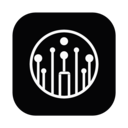
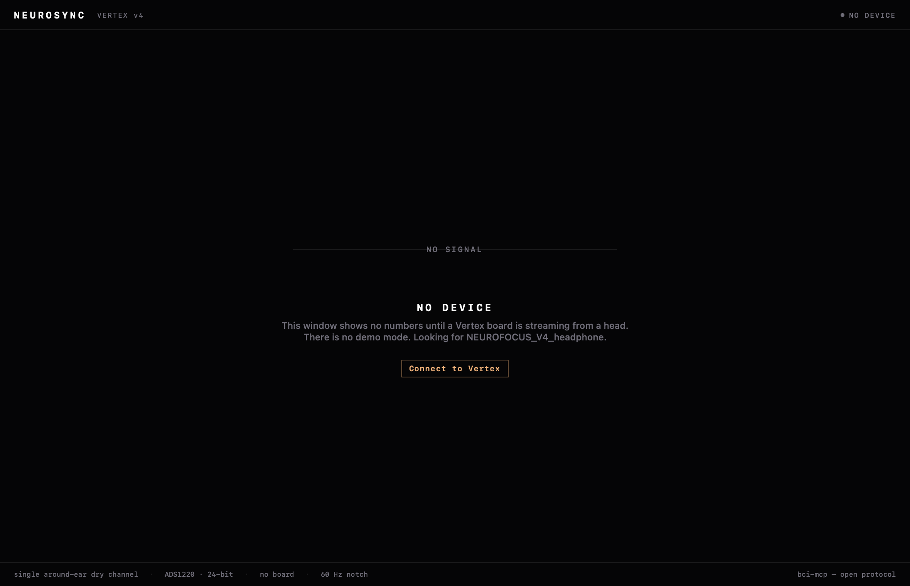
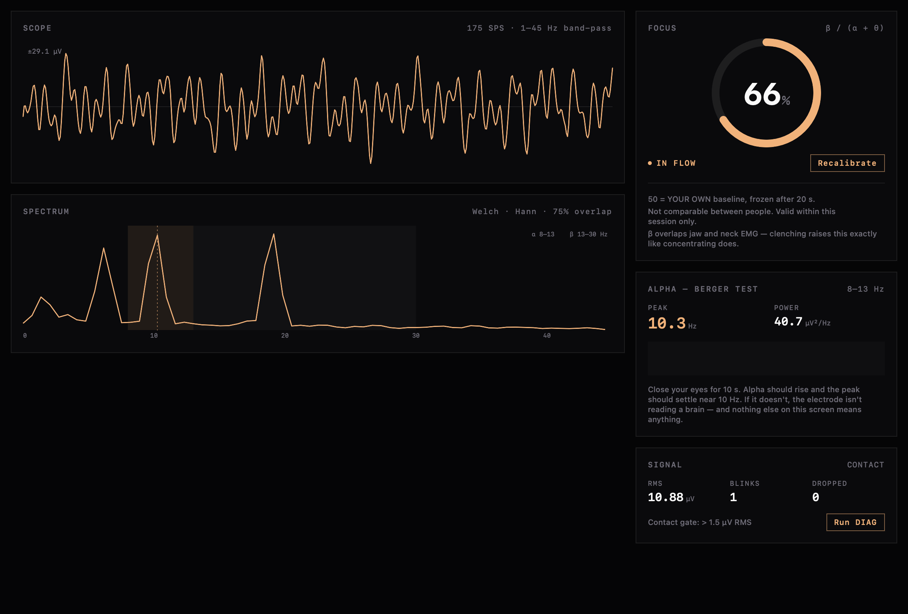
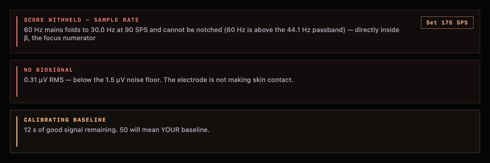
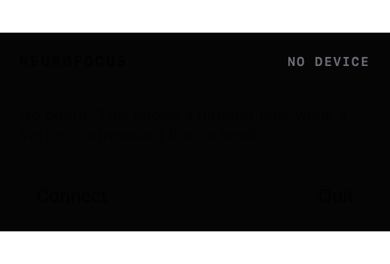

<div align="center">



# NeuroSync

**A macOS instrument for a single-channel dry-EEG headset.**

It streams raw ADC counts from the board over Bluetooth, computes the Pope engagement index
on-device — and refuses to show you a number the moment it can't defend one.

[](#build)
[](#build)
[](#architecture)
[](#tests)
[](LICENSE)



</div>

---

## There is no demo mode

That screenshot is not an error state. It is the entire thesis.

Most focus trackers will happily show you a score with the sensor sitting on a desk. They can,
because a detached electrode collapses α and θ toward the ADC noise floor — which makes β/(α+θ)
*explode*. Ungated, an unplugged headset reads as flawless concentration.

**NeuroSync has no signal generator, no sample data, and no demo mode, and none will be added.**
With no board on a head it shows a flat line and says so. Every number in this app is measured or
it is not shown.

## The instrument



A live scope (1–45 Hz band-passed, mains-notched, electrode-referred µV), a Welch spectrum with
the α and β bands called out, the focus score, and a Berger panel.

The **Berger test** is the honest proof that an electrode is on a brain and not on a table: close
your eyes and α blooms near 10 Hz; open them and it collapses. Hans Berger found it in 1929. It's
the oldest result in electroencephalography, and it needs no calibration and no trust.

## The three refusals



The gates are not error handling. They are the product.

| Gate | Refuses when | Because |
|---|---|---|
| `signalOk` | broadband RMS ≤ 1.5 µV | Below the ADC noise floor there is no biosignal. A detached electrode must never read as focus. |
| `fsOk` | sample rate < 175 SPS | At 45 and 90 SPS, **60 Hz mains aliases directly into the β band** (→15 Hz, →30 Hz) where it cannot be notched. Hum would read as concentration. |
| `calibrating` | baseline not yet frozen | Until E₀ exists there is nothing for 50 to be 50% *of*. |

When the contact gate closes, the score **freezes** at its last good value. It does not decay, and
it never spikes. That property is pinned by a test, because if it ever broke silently the app would
be lying in the most convincing way possible.

## The metric

The score is the engagement index of **Pope, Bogart & Bartolome (1995)** ([PMID 7647180][pope]):

```
E = β / (α + θ)
```

It is **never** θ/β — that ratio rises with *in*attention. E is unbounded, so it's mapped to 0–100
by a logistic in log-ratio against a per-user baseline E₀, taken as the **median** of 160 gated
updates over 20 s and then **frozen**:

```
score = 100 / (1 + (E₀/E)^k)        k = 1.5
```

which is exactly **50 when E = E₀**.

**50 means your own baseline.** The number is not comparable between people, and only within one
session. β also overlaps jaw and neck EMG, so clenching your teeth raises "focus" exactly as
concentrating does — one channel cannot separate them. The app says all of this on screen, next to
the number, permanently.

[pope]: https://pubmed.ncbi.nlm.nih.gov/7647180/

## Menu bar



The focus number lives next to the clock, so you don't have to watch a dashboard to use it.

The menu bar is the **most dangerous surface in the app**. A number in the window sits beside a
scope, a spectrum, a calibration state and a paragraph of caveats. A number beside the clock has
nowhere to put the reason — it is glanced at and believed. So it shows a dash unless *every* gate
is open, including the frozen score behind a closed contact gate, which the window may show greyed
but the menu bar must not surface at all.

A stale `88` next to the clock is indistinguishable from a live `88`.

<br clear="right">

## Hardware

Built for the **NeuroFocus Vertex v4** — a single around-ear dry electrode in a gaming headset
insert. Not Fp1, not frontal, not prefrontal: an earpad electrode is physically *around-ear*.

| | |
|---|---|
| MCU | Seeed XIAO ESP32-S3 |
| ADC | TI ADS1220, 24-bit ΔΣ, AIN0 single-ended |
| Front end | AD8422 instrumentation amp, G = 100 |
| Channels | **1** (proof of concept, scaling toward 8) |
| Sample rate | runtime-selectable: 20/45/90/**175**/330/600/1000/2000 SPS |
| Transport | BLE, `[0xE7 0x1E][seq u16 LE][n u8][n × i32 LE]` |

The firmware is the source of truth for the wire protocol; `BLE/VertexProtocol.swift` is derived
from it, never from memory. Two things there are silent footguns and are documented in the source:

- **The command characteristic also notifies.** `INFO`/`DIAG` come back on it, and the peripheral
  drops a notify whose CCCD isn't enabled — so you must subscribe *before* writing `i`.
- **The sample rate survives a BLE reconnect.** A client that assumes the 175 SPS boot default
  after reconnecting to a board someone left at 600 renders real 10 Hz α at ~34 Hz, and every
  frequency in the spectrum slides by the same ratio. Always read `sps` from `INFO`.

## Architecture

```
BLE/VertexProtocol.swift   wire contract — UUIDs, frame decode, INFO/DIAG parse, rate ladder
BLE/VertexLink.swift       CoreBluetooth central + DSP on a serial queue (nonisolated)
Core/DSP.swift             biquads, filter chain, Welch PSD, band powers, counts→µV
Core/Focus.swift           the Pope index, the frozen baseline, the gates
Core/Gate.swift            which refusal is blocking, and what the menu bar may say — pure
App/VertexModel.swift      @MainActor @Observable view state
UI/                        theme, scope/spectrum canvases, panels, menu bar
```

Signal flows one way: **CoreBluetooth → decode → FocusEngine → snapshot → @MainActor.** The link
never touches the UI; the model never touches the radio or the DSP.

The DSP is ported constant-for-constant from the browser analyzer so the two cannot disagree about
what a brain is doing. Two deviations from `scipy.signal.welch` are load-bearing and easy to trip
over: the Hann window is **symmetric** (`n-1` denominator, not scipy's periodic) and the detrend is
**linear** (not scipy's constant). Matching scipy would silently shift every band power.

## Build

Requires Xcode 26+ and macOS 26+. No package manager, no dependencies.

```bash
git clone https://github.com/enkhbold470/neurosync.git
cd neurosync
xcodebuild build -scheme neurosync -destination 'platform=macOS,arch=arm64'
```

Or just open `neurosync.xcodeproj` and hit run.

App Sandbox is on, so CoreBluetooth needs `com.apple.security.device.bluetooth` plus
`NSBluetoothAlwaysUsageDescription` — both are wired up. The radio is created lazily on your first
**Connect**, not at launch, so the permission prompt appears when you actually ask for it.

## Tests

```bash
xcodebuild test -scheme neurosync -destination 'platform=macOS,arch=arm64' -only-testing:neurosyncTests
```

25 tests, no hardware required. They pin the things that would put a false number on screen:

- a detached electrode never reads as high focus, and freezes rather than spiking
- the metric is β/(α+θ) — separated by test from both θ/β and β/(α+β)
- 60 Hz mains folds to exactly 30.0 Hz at 90 SPS, and the engine refuses to score there
- the menu bar shows a dash behind every closed gate
- the binary frame decoder rejects truncated frames (a small ATT MTU truncates *silently*)
- α from a real 10 Hz rhythm is found at 10 Hz — not at 34 Hz, which is what hard-coding `fs` does

> **Running a single Swift Testing test?** The trailing `()` is required.
> Without it the filter matches nothing **and `xcodebuild` still exits 0** — a green run that ran
> no tests.
> ```bash
> xcodebuild test -scheme neurosync -destination 'platform=macOS,arch=arm64' \
>   '-only-testing:neurosyncTests/detachedElectrodeNeverReadsAsHighFocus()'
> ```

## Status — read this before you judge the screenshots

**No screenshot in this README shows a real EEG capture.** The instrument image is rendered from a
synthetic fixture pushed through the real DSP — the spectrum, band powers and score are genuinely
computed, but the input is a signal generator, not a person. **This app has not yet been run
against physical hardware.**

When it has, these images get replaced with a real capture and this section gets deleted.

It would have been easy to ship a screenshot that implied otherwise. That is the exact thing this
codebase exists to refuse, and the rule does not stop applying at the README.

## Not a medical device

NeuroSync does not diagnose, treat, cure or prevent anything. Don't make a medical decision with it.

## License

[MIT](LICENSE) © Enkhbold Ganbold
